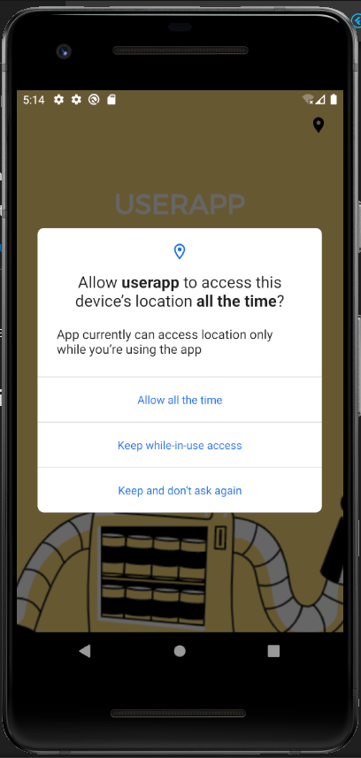
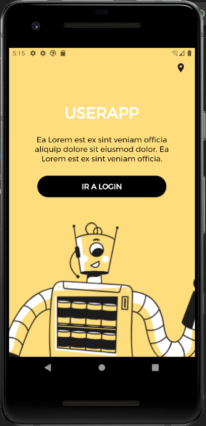
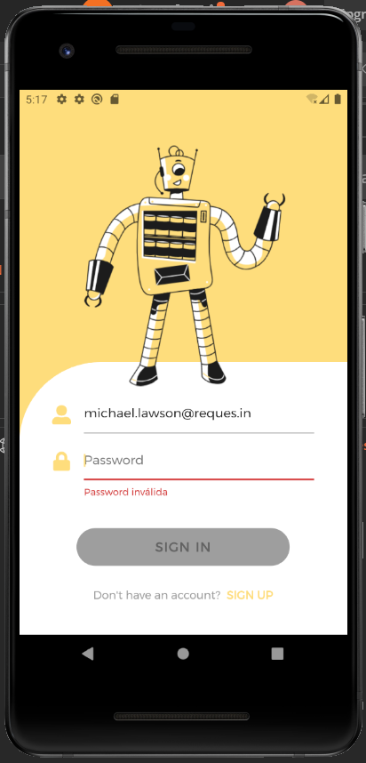
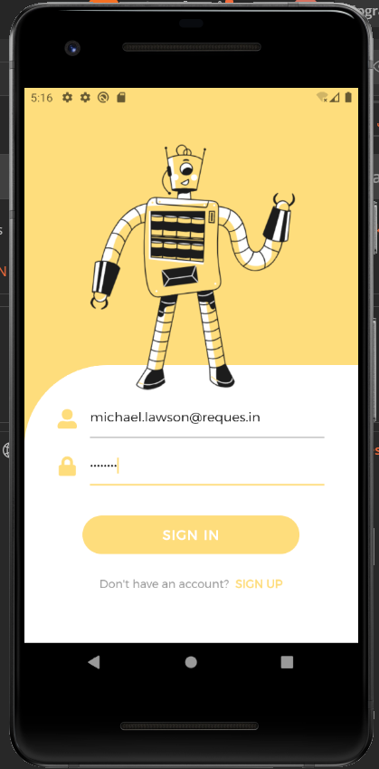
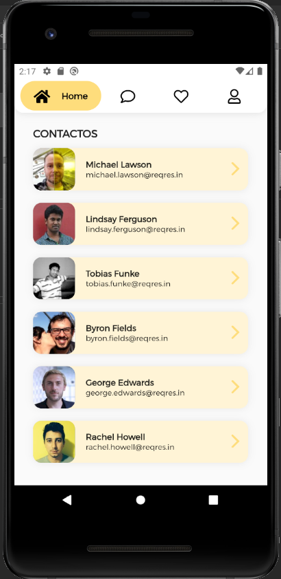

# User App

Es una aplicación de prueba para el listado de usuarios, de una api rest.

## Getting Started

Para probar la aplicación descargue el repositorio, e instale los paquetes de flutter con:

```
flutter pub get
```

## Imagenes de la aplicación

# Vista Splash




# Vista Login




# Vista Home


